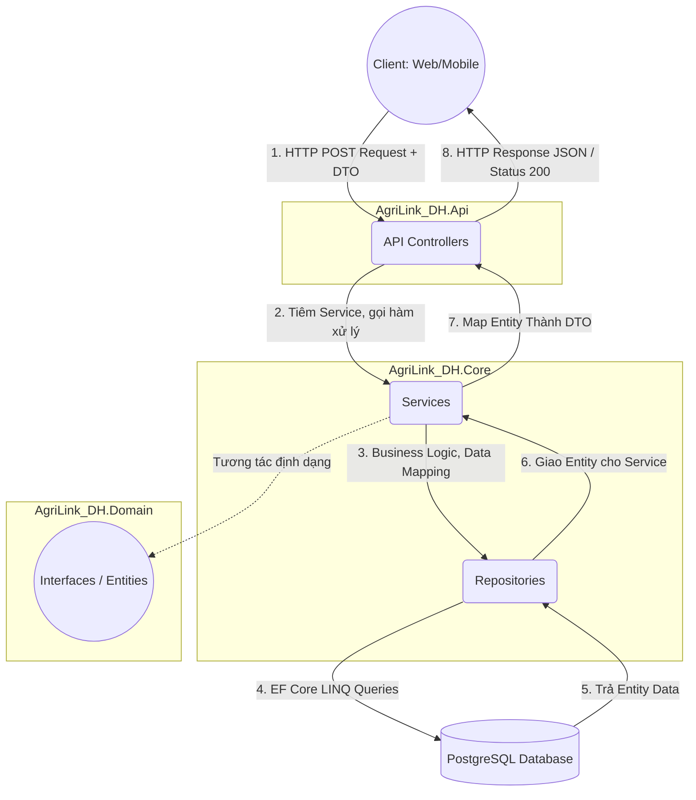

# Kiến Trúc và Luồng Hoạt Động (Architecture & Workflow) - AgriLink_DH

Tài liệu này tóm tắt về mô hình kiến trúc, các khái niệm (Concepts) và luồng đi của một Request trong Backend AgriLink_DH. Nó sẽ giúp định hướng rõ ràng khi bạn hoặc team tích hợp, phát triển và mở rộng dự án.

---

## 🏗️ 1. Cấu Trúc Các Tầng (Layers / Projects)

Dự án AgriLink_DH được thiết kế theo tư tưởng **N-Tier Architecture (Kiến trúc đa tầng)** có hơi hướng của **Clean Architecture**. Hiện tại, giải pháp chia thành 4 lớp chính:

### 1. `AgriLink_DH.Domain` (Tầng Lõi - Core Domain)
- **Chứa gì:** Dữ liệu thuần túy nhất, không phụ thuộc vào bất kỳ thư viện hay hệ quản trị CSDL nào.
- **Thành phần:** 
  - Các Entity Classes / Models (`User`, `Product`, `Article`...).
  - Các Interfaces định nghĩa hợp đồng hệ thống (`IRepository<T>`, `IUnitOfWork`, `IMarketPriceRepository`...).

### 2. `AgriLink_DH.Share` (Tầng Dùng Chung)
- **Chứa gì:** Các thành phần vận chuyển dữ liệu và các hằng số dùng chung giữa API và Core.
- **Thành phần:**
  - **DTOs (Data Transfer Objects):** Dùng để nhận Request từ Client và trả Response (Ví dụ: `CreateArticleDto`, `TaskTypeResponseDto`). Giúp giấu đi cấu trúc nội tại của Database.
  - Constants, Helper Enums.

### 3. `AgriLink_DH.Core` (Tầng Nghiệp Vụ & Truy cập dữ liệu - Business & Infrastucture logic)
- **Chứa gì:** Logic nghiệp vụ, định nghĩa các chức năng của ứng dụng (Use Cases) và giao tiếp trực tiếp với DB.
- **Thành phần:**
  - **Services (`AuthService`, `MarketPriceDbService`...):** Xử lý quy tắc nghiệp vụ.
  - **Repositories (`UserRepository`...):** Triển khai (Implement) các Interface từ tâng Domain, thực thi LINQ queries qua Entity Framework Core.
  - **Configurations (`ApplicationDbContext`):** Cấu hình Entity Framework, Relationship của các bảng.

### 4. `AgriLink_DH.Api` (Tầng Giao Tiếp - Presentation Layer)
- **Chứa gì:** Điểm chạm với người dùng (Web/Mobile App). Phụ thuộc vào `Core` và `Share`.
- **Thành phần:**
  - **Controllers:** Điều hướng các Endpoints (HTTP GET, POST,...).
  - **Extensions / Program.cs:** Thiết lập Dependency Injection (DI), Authentication (JWTBearer), Swagger.
  - **Migrations:** Quản lý thay đổi cấu trúc bảng của Database.

---

## 🔄 2. Luồng Hoạt Động Của Một Request (Workflow)

Khi Client (Mobile App / Web React) gửi 1 yêu cầu (VD: *Tạo mới một bài viết*), luồng đi sẽ như sau:

### Chi tiết các bước:
1. **Controller (`ArticleController`):** Nhận JSON từ body -> Chuyển thành `CreateArticleDto`. Validate token JWT của người đăng user.
2. **Service (`ArticleService`):** Áp dụng Business Rule (Giới hạn độ dài, tự sinh tạo *Slug*, kiểm tra trùng lặp). Map `dto` mỏng sang `Article` *Entity* đầy đủ.
3. **Repository (`ArticleRepository`):** Lấy Data từ Memory/Database hoặc Tracking thao tác mới thông qua DbSet (`_context.Articles.Add(entity)`).
4. **UnitOfWork (`UnitOfWork`):** Ở Service, gọi `_unitOfWork.SaveChangesAsync()`. Hành động này mở 1 **Database Transaction**, ghim mọi thao tác xuống PostgresSQL.
5. **Hoàn thành:** Controller map đổi dữ liệu thành `ArticleDto` (ẩn các phần DB không cần thiết), trả về JSON kèm mã HTTP `200 OK` hoặc `201 Created`.

---

## 🧠 3. Các Khái Niệm / Design Pattern Chủ Chốt (Concepts)

Hệ thống tuân thủ chặt chẽ 4 Design Pattern tiêu biểu cho Backend .NET:

### A. Repository Pattern
*Tránh Service viết trực tiếp `_context.Users.Where(...)`.*
- Chúng ta dùng interface `IRepository<T>` kèm một base `BaseRepository<T>` chuẩn hóa lệnh CRUD cơ bản (Thêm, Sửa, Xóa).
- Khi cần các Query phức tạp hơn, tạo `SpecificRepository` (VD: `ProductRepository`) kế thừa `BaseRepository`.
- **Lợi ích:** Service không cần quan tâm là dùng SQL Server, PostgreSQL, hay Dapper. Mọi thứ được trừu tượng hóa.

### B. Unit of Work Pattern (UoW)
*Giải quyết bài toán "Tính toán đồng bộ"* (ACID).
- Thay vì gọi `SaveChanges` tại 10 Repositories khác nhau dẫn tới rủi ro nửa chừng bị lỗi làm hỏng data. `UnitOfWork` nhóm toàn bộ các Repositories thành 1 Context.
- Ở tầng Service, sau khi Add, Update qua nhiều Repository, chỉ gọi đúng `_unitOfWork.SaveChangesAsync()` 1 lần duy nhất ở cuối hàm. (All or nothing).

### C. Dependency Injection (DI)
- Việc khởi tạo Instance của Object (như `new ArticleService()`) sẽ được ASP.NET tự động "tiêm" vào Constructor (Inversion of Control).
- File thiết lập: `ServiceCollectionExtensions.cs`.
- Trong project này Lifecycle chủ yếu là **Scoped** (1 instance per HTTP Request). Riêng các service như Redis, Cloudinary thì là **Singleton** (1 instance xuyên suốt vòng đời App).

### D. Cache-Aside Pattern (Với Redis)
*Tránh quá tải DB đối với những dữ liệu nhiều người đọc nhưng ít khi thay đổi (List bài viết, Tỉnh thành, Khí hậu).*
- **Cách AgriLink xử lý:** Tạo một lớp trừu tượng `BaseCachedService`. Các Service kế thừa nó.
- **Tiến trình:** Web hỏi -> Check Redis. Nếu có, return ngay lập tức (dưới 5ms). Nếu chưa có (Miss), chọc vào PostgreSQL lấy dữ liệu ra -> Cache vào Redis với mốc T-T-L (Time-To-Live = VD: 15 phút) -> Return cho User.
- Mỗi lần có sự kiện Thêm/Sửa/Xóa (Write action), gọi hàm Invalidate (xóa) Cache cũ đi.

---
Vững cấu trúc và các mô hình này, việc fix bug và maintain hệ thống sẽ trở nên đồng bộ và dễ dàng hơn rất nhiều.
